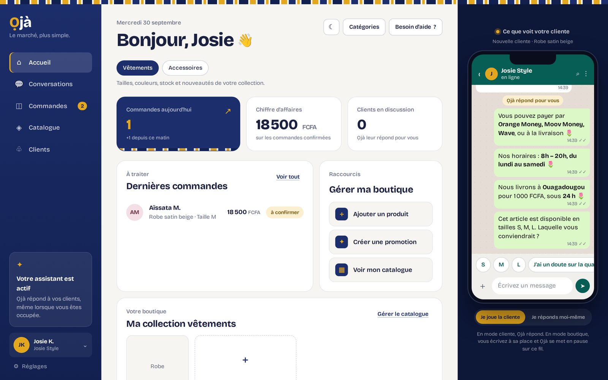
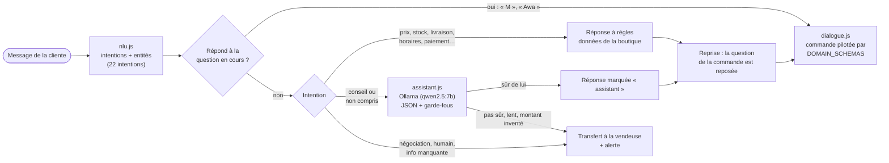

# 🧺 Ọjà — un assistant de vente WhatsApp pour les petites boutiques de Ouagadougou

Assistant conversationnel pour les commerçantes qui vendent vêtements, cosmétiques et accessoires sur WhatsApp. Il répond aux clientes en français, connaît le catalogue de la boutique, prend des commandes complètes et **rend la main à la vendeuse dès qu'il n'est pas sûr**. Règles en JavaScript sans dépendance, modèle de langue local via **Ollama**, aucune clé d'API. Conçu avec une commerçante pilote.

*Ọjà* veut dire « marché » en yoruba.



*Démo (`npm start`) : à gauche l'espace vendeuse, à droite ce que voit la cliente. Un seul message (« vous livrez où, c'est quoi vos horaires et on peut payer par wave ? ») reçoit trois réponses tirées du profil de la boutique, puis Ọjà repose la question de la commande en cours (la taille).*

Une commerçante de Ouaga répond toute la journée aux mêmes questions : prix, tailles, couleurs, livraison, Orange Money ou Wave ? Une cliente qui attend trop longtemps s'en va. Ọjà part d'une règle tirée de sa pratique à elle : **répondre tout de suite à ce que la boutique sait déjà, et passer le reste à un humain.**

Le projet cherche donc à mesurer :

- quelle part des messages Ọjà traite **seul**, depuis les données de la boutique ;
- quelle part il confie au **modèle local** (questions de conseil : « ça se lave en machine ? ») ;
- quelle part il **transfère** à la vendeuse, et s'il transfère bien ce qui doit l'être (négociation, demande d'humain, information absente) ;
- et comment se comporte le NLU sur des messages **qu'il n'a jamais vus**.



## Résultats

### Qui répond ?

Mesuré par [`eval_routing.js`](eval_routing.js) avec le moteur réel (`nlu.js` + `dialogue.js`), sur une boutique au profil complet. Chaque message ouvre une conversation neuve. Le modèle n'est pas appelé : on mesure ici la **décision de routage**, pas la qualité de ses réponses.

| | Jeu inédit (80 messages) | Corpus de non-régression (101) |
|---|---|---|
| Ọjà répond seul (règles) | **58 %** | 60 % |
| Confié à l'assistant local | 35 % (11 conseils, 17 non compris) | 27 % |
| Transféré directement à la vendeuse | 8 % | 13 % |

**Sans assistant, Ọjà traite seul près de 6 messages sur 10. Avec l'assistant activé, 93 % des messages ne partent pas directement chez la vendeuse** (l'assistant peut encore transférer s'il n'est pas sûr).

Routage attendu vs obtenu sur le jeu inédit :

| | Routage correct |
|---|---|
| Première mesure, à l'aveugle (v2.5) | 70/80 (87,5 %) |
| Après correction de 2 faux amis (v2.6) | **72/80 (90 %)** |

La mesure à l'aveugle est la seule qui compte comme estimation. Après correction, les deux phrases concernées ne sont plus inédites : le 90 % est optimiste de ces deux points.

| attendu \ obtenu (v2.6) | règles | assistant | vendeuse |
|---|---|---|---|
| règles | **46** | 5 | 0 |
| assistant | 0 | **20** | 0 |
| vendeuse | 0 | 3 | **6** |

- **Aucun message n'est traité à tort par les règles** : ni ceux qui devaient aller à la vendeuse, ni ceux qui devaient aller à l'assistant.
- **Les 2 faux amis corrigés** (trouvés par la mesure à l'aveugle) :
  - « vous faites des robes sur mesure ? » répondait par la liste des tailles, car « mesure » était pris pour une question de taille ;
  - « ma commande d'hier est arrivée où ? » démarrait une nouvelle commande.

  Les deux vont maintenant à l'assistant, qui transfère faute de données : Ọjà n'a ni suivi de commande ni information sur le sur-mesure. Ils sont ajoutés au corpus de non-régression et aux tests du moteur.
- **3 messages qui devaient aller directement à la vendeuse passent par l'assistant** : « fais-moi 15 000 », qui n'est pas reconnu comme une négociation, et deux questions d'adresse. Le prompt impose de transférer ce qui n'est pas dans les données, mais c'est moins sûr qu'un transfert direct.
- **5 messages que les règles devraient traiter partent à l'assistant**, faute de mot-clé : « on paie comment », « on dit quoi », « mettez m'en deux »…

### NLU : l'écart entre le corpus d'ajustement et des phrases inédites

| Jeu | Exactitude de l'intention principale |
|---|---|
| Corpus de non-régression (101 phrases, règles ajustées dessus) | 101/101 (100 %) |
| **Jeu inédit**, première mesure à l'aveugle | **60/80 (75 %)** |
| Jeu inédit après correction des 2 faux amis | 62/80 (77,5 %) |

Les 100 % ne mesurent que la non-régression. **Le chiffre qui compte est 75 %.** Les erreurs restantes se regroupent :

- **Abréviations SMS** : « cmb », « cbn » (combien) ne sont pas reconnus.
- **Formulations sans mot-clé** : « on paie comment », « c'est où votre boutique », « on dit quoi » (salutation burkinabè), « mettez m'en deux ».
- **Mot-clé trompeur** : « si je **commande** aujourd'hui je reçois quand » est une question de livraison, pas une commande.

Beaucoup de ces messages ne sont pas perdus : sans intention reconnue, ils partent à l'assistant, qui a le catalogue et les règles de la boutique dans son prompt. C'est ce qui explique l'écart entre le NLU (75 %) et le routage (87,5 %).

### L'assistant local

Testé à la main avec `qwen2.5:7b` sur un PC portable sous Windows : les réponses de conseil sont jugées satisfaisantes par l'auteur, et plus naturelles qu'avec `llama3.2` (3B), qui produisait des tournures maladroites (« éviter les rayures » pour un tissu). Le premier appel est plus lent, le temps que le modèle se charge en mémoire. Ọjà le précharge dès l'activation et attend jusqu'à 60 s. **Pas encore d'évaluation chiffrée** des réponses (voir « Ce qui reste à améliorer »).

**Ce qui reste à améliorer**

- Élargir le NLU aux abréviations SMS et aux formules locales, **puis mesurer sur un nouveau jeu inédit** (réajuster sur celui-ci le rendrait optimiste).
- Détecter la négociation par les montants (« fais-moi 15 000 ») pour la transférer directement, sans passer par le modèle.
- Constituer un **nouveau jeu inédit** (idéalement de vraies phrases anonymisées de la boutique pilote) : celui-ci a commencé à servir à corriger les règles.
- Évaluer les réponses de l'assistant avec un LLM-juge et un échantillon annoté à la main, comme pour [merimee-rag](https://github.com/ezechiel-sawadogo-nlp/merimee-rag).

**Limites** : le jeu inédit a été écrit à la main, pas collecté auprès de vraies clientes. Il imite leur style mais reste une approximation. Chaque message est évalué seul, hors de toute conversation. Les 80 phrases donnent un ordre de grandeur, pas une mesure fine.

## Ce qu'Ọjà sait faire

- **Comprendre le texte libre en contexte.** « M » est une taille quand Ọjà vient de demander la taille, un prénom est reconnu quand il a demandé le nom. « corail en 5 g » règle teinte et format d'un coup. Il tolère les fautes (« horraires », « livraisson ») et l'absence d'accents.
- **Répondre à plusieurs questions dans un message**, jusqu'à 3, puis **reprendre la commande** là où elle en était.
- **Prendre des commandes complètes** : panier multi-produits, quantités, photo par variante, livraison ou retrait, mobile money, paiement échelonné si la boutique l'autorise. Le stock est décrémenté à chaque commande.
- **Confier les questions de conseil au modèle local** : entretien, coupe, usage d'un cosmétique, type de peau, étanchéité, occasion.
- **Transférer plutôt qu'inventer.** La négociation, la demande d'humain et les informations absentes créent une alerte. La vendeuse peut **reprendre la main** sur une conversation, et Ọjà se met alors en pause sur ce fil.
- **Espace vendeuse** : démarrage guidé depuis une boutique vide, catalogue avec photos et vidéos, commandes, clientes, conversations, profil, export CSV. Une seule base de code, responsive sur ordinateur et mobile.

## Choix de conception

| Choix | Pourquoi |
|---|---|
| **Règles d'abord, modèle ensuite** | Une commerçante doit pouvoir faire confiance aux prix et aux délais annoncés. Les règles sont prévisibles, instantanées et ne peuvent pas inventer un chiffre. Le modèle ne sert qu'à ce que les règles ne savent pas faire. |
| **Deux niveaux dans le prompt** : faits de la boutique / conseils | Prix, stock, livraison et paiement viennent **uniquement** des données. Les conseils (« ça se lave en machine ? ») peuvent venir des connaissances générales, en s'appuyant sur la matière de l'article et en restant prudents. |
| **Garde-fous côté client**, pas seulement dans le prompt | Un petit modèle ne respecte pas toujours ses consignes. Tout montant en FCFA absent des données est refusé, et une réponse de conseil ne peut contenir aucun montant. |
| **Sortie JSON** `{answer, confident, type}` | « Pas sûr » devient une valeur testable : si le modèle n'est pas sûr, Ọjà transfère. |
| Intention **`advice`** prioritaire sur ses voisines | « le tissu est transparent ? » n'est pas une question de matière, « ça taille petit ? » n'en est pas une de taille, et « c'est bon pour les peaux grasses ? » n'est pas un « oui ». |
| **Un moteur, des schémas** (`DOMAIN_SCHEMAS`) | Trois flux copiés-collés (vêtements, cosmétiques, accessoires) sont devenus un seul moteur déclaratif. Ajouter une catégorie revient à ajouter un schéma. |
| **Moteur sans DOM** | `nlu.js` et `dialogue.js` tournent tels quels dans Node (`server/engine.js`) : c'est ce moteur qui répondra sur WhatsApp. |
| **Ollama en local, qwen2.5:7b** | Gratuit, sans compte ni carte bancaire, les données restent sur la machine. Au test, qwen2.5:7b écrivait un français plus naturel que llama3.2 (3B). |
| **Diagnostic visible par la vendeuse** | Quand l'assistant ne répond pas, une étiquette dit pourquoi : Ollama injoignable, délai dépassé, pas sûr, garde-fou. Elle n'est jamais envoyée à la cliente. |
| **Serveur Node sans dépendance** | Un seul fichier JSON écrit de façon atomique. Il est facile à héberger et à relire, et les trois fonctions de stockage se remplacent par SQLite le jour où il y aura plusieurs boutiques. |

## Installation (Windows / PowerShell)

Il faut **Node.js 18 ou plus**. Il n'y a aucune dépendance npm à installer.

```powershell
git clone https://github.com/ezechiel-sawadogo-nlp/oja.git
cd oja
npm start                    # → http://localhost:3000
```

Assistant local (optionnel) :

```powershell
ollama pull qwen2.5:7b       # recommandé (≈ 5 Go) ; qwen2.5:3b ou llama3.2 pour un PC modeste
```

Puis dans Ọjà : **Réglages → Assistant local → Ollama**, modèle `qwen2.5:7b`, puis **Tester la connexion**. Une pastille « Assistant Ollama activé » apparaît au-dessus du téléphone.

Configuration du serveur : copier `.env.example` en `.env`.

| Variable | Effet |
|---|---|
| `OJA_PASSWORD` | Protège l'espace vendeuse (HTTP Basic). |
| `WHATSAPP_VERIFY_TOKEN` | Jeton de vérification du webhook Meta. |
| `WHATSAPP_APP_SECRET` | Si défini, chaque appel du webhook doit porter une signature Meta valide. |
| `PORT`, `OJA_DATA` | Port (3000 par défaut) et fichier de données (`server/data/oja-state.json`, exclu de Git). |

## Utilisation

```powershell
npm start               # interface vendeuse + simulateur WhatsApp
npm run chat            # parler au moteur dans le terminal, avec les vraies données
```

Au premier lancement, la boutique est vide. Pour découvrir Ọjà sans rien saisir, choisissez « Découvrir d'abord avec 3 articles d'exemple », puis jouez la cliente dans le téléphone.

## Reproduire l'évaluation

```powershell
npm run eval:routing    # qui répond ? (jeu inédit, 80 messages) + matrice attendu/obtenu
npm run eval:inedit     # NLU sur le jeu inédit
npm run eval:nlu        # NLU sur le corpus de non-régression (échoue au moindre écart)
node eval_routing.js --file corpus/corpus_clientes.jsonl
```

- [`corpus/corpus_clientes.jsonl`](corpus/corpus_clientes.jsonl) : 101 phrases annotées (intention, entités attendues), qui ont servi à ajuster les règles. C'est un **jeu de non-régression**.
- [`corpus/test_inedit.jsonl`](corpus/test_inedit.jsonl) : 80 phrases écrites après coup, avec l'intention et le **routage attendu** (`regles` / `assistant` / `vendeuse`). La première mesure a été faite à l'aveugle. Seuls les 2 faux amis décrits plus haut ont été corrigés ensuite.

## Tests

```powershell
npm test                # moteur (19) + NLU (101) + interface (368 tests Playwright)
```

Les tests d'interface demandent Python 3 et Playwright (`pip install playwright` puis `python -m playwright install chromium`). Chaque fichier `tests/test_*.py` lance son propre serveur et un Chromium sans écran. **Ollama est simulé** : les tests vérifient le routage, les garde-fous et la reprise de commande, sans télécharger de modèle. Tout tourne aussi à chaque push via GitHub Actions.

## État et suite

Ọjà est un prototype fonctionnel, avec un serveur prêt pour WhatsApp. Il n'est pas encore branché sur un vrai numéro.

1. ✅ NLU, moteur de dialogue unifié, espace vendeuse, reprise en main, assistant local
2. ✅ Serveur Node : état partagé, moteur hors navigateur, vérification du webhook
3. ⏳ Test par la commerçante pilote, puis enrichissement du corpus avec ses vraies phrases (anonymisées)
4. ⏳ Hébergement, compte Meta Business et numéro dédié
5. ⏳ Brancher le webhook sur `server/engine.js`, avec l'assistant côté serveur (voir [`docs/WHATSAPP.md`](docs/WHATSAPP.md))
6. Ensuite : plusieurs boutiques, mobile money, statistiques, langues locales (mooré, dioula)

Le journal détaillé des évolutions est dans [`CHANGELOG.md`](CHANGELOG.md), le cahier des charges initial dans [`CAHIER_DES_CHARGES_MVP.md`](CAHIER_DES_CHARGES_MVP.md).

## Données

Aucune donnée réelle de cliente dans ce dépôt. Les deux corpus sont rédigés à la main. Le catalogue de démonstration (robe, sac, coffret) est fictif. Les données d'une boutique réelle restent dans `server/data/`, exclu de Git.

## Licence

© 2026 Ezéchiel Sawadogo. Tous droits réservés : code consultable, mais aucune réutilisation sans autorisation écrite. Voir [LICENSE](LICENSE).
